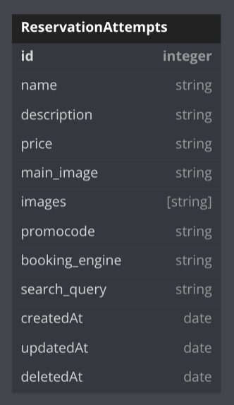

# Instruções

## PostgreSQL

1. Garanta que tem o PostgreSQL instalado e rodando na máquina.
2. Crie uma database, que um usuário possa acessar com senha.
3. Garanta que é possível estabelecer a conexão e criar tabelas, via linha de comando (psql).

## API:

1. Ao clonar o repositório, garanta que existe uma pasta chamada ".cache/" na raiz do projeto.
2. Execute o comando "npm install" e aguarde até que todas as bilbiotecas sejam baixadas.
3. Crie um arquivo .env, contendo as seguintes propriedades: [DB_USERNAME, DB_PASSWORD, DB_NAME, DB_HOST, DB_PORT,SERVER_PORT]
4. Para iniciar a aplicação, use "npm start"
5. Se tudo estiver configurado, o console deve logar:
   "Server is listening on port DB_PORT
   Connected to postgres database."

### Issues Possíveis

a) Se a Model (ReservationAttempts) do Sequelize não inicializar por conta própria, execute o script "npm run migrate" para forçar que a model seja criada na sua database de escolha, via migration.
 
b) Se rodar uma migration e não quiser consertar do jeito "delicado", TRUNCANTE na tabela SequelizeMeta ou DROP TABLE na problemática é uma possibilidade (pouco digna, mas viável no começo de projeto enquanto a brutalidade não pune tanto). No pior dos casos um DUMP do banco alivia a consciência.

## Documentação da API
https://documenter.getpostman.com/view/15861538/2s93RWPraQ

## Sonar Cloud findings (bugs, code smells, vulnerabilities, security flaws):

## Git Guardian incidents

## Database: única model usada

